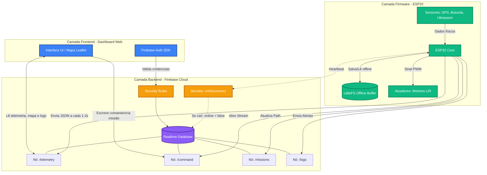
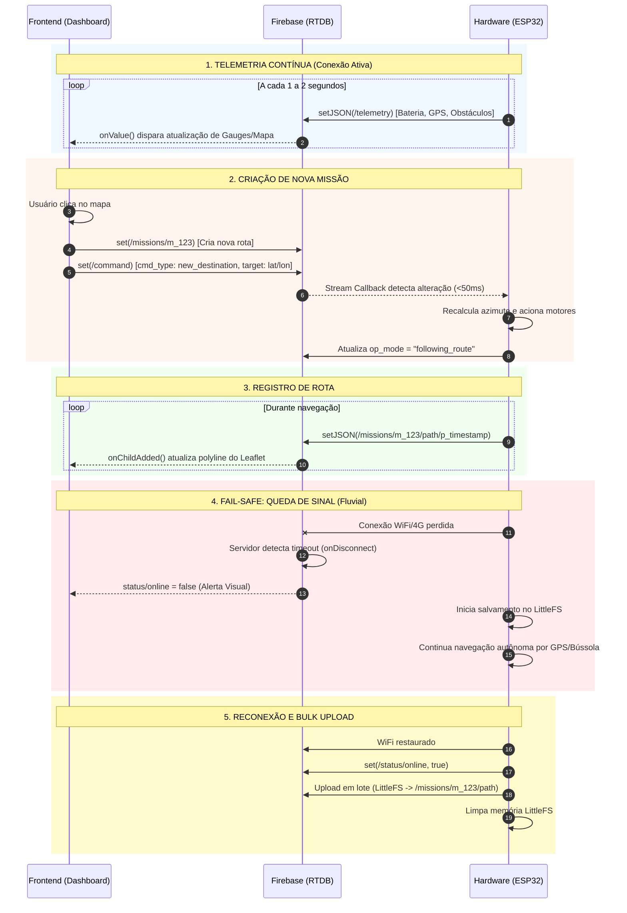
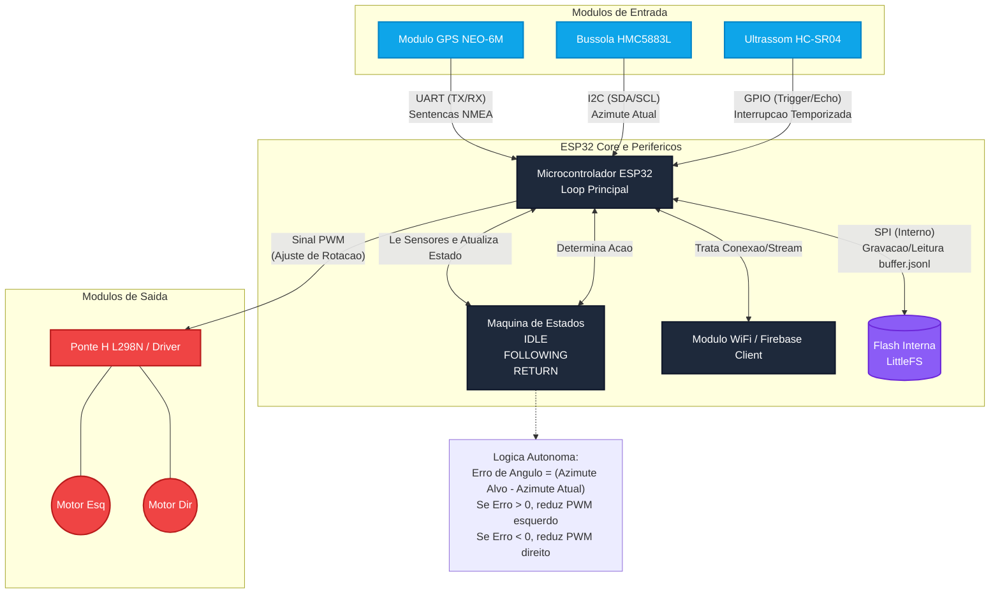

# USV-AM - Manual de Execucao Tecnica (MVP)

## 1. Motivacao e Objetivo
O projeto USV-AM propoe um drone fluvial autonomo de baixo custo para o contexto hidrico do Amazonas, com foco em navegacao autonoma, deteccao de obstaculos e telemetria em tempo real.

Objetivo do MVP: entregar e validar um prototipo funcional de embarcacao tipo catamara, usando hardware aberto e materiais acessiveis, capaz de navegar entre coordenadas GPS, evitar colisao e ser monitorado remotamente.

## 2. Escopo Funcional do MVP

### 2.1 Firmware (ESP32)
- Navegacao autonoma por propulsao diferencial com 2 motores.
- Navegacao GPS por missao com alvo ativo (`target`) e historico de rota (`path`).
- Controle de rumo com bussola digital.
- Percepcao de obstaculos com sensor ultrassonico.
- Telemetria para nuvem e operacao fail-safe offline com buffer em `LittleFS`.
- Compensacao de correnteza por algoritmo LOS usando estimativa por GPS NEO-6M + heading (detalhes na Secao 8).

### 2.2 Backend/Cloud (Firebase RTDB)
- Armazenar telemetria, comando, missoes e logs.
- Disponibilizar dados estruturados para monitoramento de rota, sensores e alertas.
- Suportar controle remoto por coordenadas.
- Aplicar regras de seguranca e indices de performance.

### 2.3 Frontend (React)
- Dashboard em React com estado de missao, sensores e atuadores.
- Mapa com React Leaflet para operacao remota por selecao de coordenadas.
- Visualizacao de rota percorrida e logs de eventos.
- Indicadores de conectividade (`online/offline`) e estado operacional.

## 3. Arquitetura Tecnica

| Camada | Stack | Responsabilidade |
|---|---|---|
| Firmware | ESP32 + Firebase-ESP-Client + TinyGPS++ + LittleFS | Controle autonomo, leitura de sensores, envio de telemetria |
| Backend/Cloud | Firebase RTDB + Security Rules | Persistencia, seguranca, presenca, historico |
| Frontend | React + React Leaflet + Firebase SDK | Operacao remota, dashboard, visualizacao |
| Telemetria em tempo real | MQTT Broker (ponte opcional para dashboard) | Streaming de baixa latencia para gemeo digital |

### 3.1 Fluxo macro
1. Frontend cria/atualiza missao e escreve comando no RTDB.
2. Firmware escuta stream de comando, executa navegacao e atualiza telemetria.
3. Firmware registra `path` da missao e logs de eventos.
4. Frontend renderiza rota, estado e alertas em tempo real.
5. Em perda de conexao, firmware salva buffer em `LittleFS` e faz flush ao reconectar.

## 3.2 Fluxogramas (Mermaid)

### 3.2.1 Arquitetura geral


### 3.2.2 Sequencia de comunicacao (Frontend <-> Firebase <-> Firmware)


### 3.2.3 Logica de hardware (firmware)


## 4. Componentes e Materiais

### 4.1 Eletronica principal
| Quant. | Componente | Funcao |
|---|---|---|
| 1 | Microcontrolador (ESP32) | Processamento e comunicacao Wi-Fi |
| 1 | Modulo GPS NEO-6M | Coordenadas geograficas e velocidade/curso sobre o solo |
| 1 | Bussola digital | Determinacao de rumo da embarcacao |
| 1 | Sensor de obstaculo ultrassonico | Deteccao de obstaculos flutuantes e margens |
| 1 | Driver de motores (ponte H) | Controle de potencia enviada aos motores |
| 2 | Motores | Propulsao diferencial da embarcacao |
| 1 | Bateria | Alimentacao do prototipo |
| 1 | Carregador de bateria | Recarga segura |
| 1 | Regulador de tensao | Estabilizacao de tensao |

### 4.2 Estrutura fisica
| Quant. | Componente | Funcao |
|---|---|---|
| 2 | Garrafas PET | Flutuadores do catamara |
| 1 | Pote plastico | Caixa estanque para eletronica |

### 4.3 Conexao e montagem
| Quant. | Material | Funcao |
|---|---|---|
| ~10 | Jumpers | Interligacao entre componentes |
| 2 | Conectores eletricos | Engate/desengate de circuitos |
| 1/1 | Solda e ferro de solda | Fixacao eletrica permanente |
| 1 | Fita isolante | Protecao e isolamento |
| 1 | Cola quente | Fixacao mecanica |
| 4 | Parafusos pequenos | Fixacao estrutural |
| 2 | Suportes/abracadeiras plasticas | Organizacao de cabos |

### 4.4 Software e ferramentas
- Arduino IDE 2.x ou PlatformIO
- React + Vite (frontend)
- Firebase RTDB + Firebase Auth
- MQTT Broker (Mosquitto ou equivalente)
- Bibliotecas de GPS e sensores (TinyGPS++, drivers I2C/GPIO)

## 5. Manual de Execucao por Camada (Sequencial)

## 5.0 Etapa comum (obrigatoria para iniciar)
1. Criar e versionar estrutura do repositorio (`firmware`, `backend`, `frontend`, `docs`).
2. Provisionar projeto Firebase (RTDB + Auth) e configurar variaveis seguras.
3. Montar o hardware minimo e validar alimentacao estavel.
4. Definir `drone_id` padrao do MVP (ex.: `drone_01`).

Criterio de saida: ambiente pronto, acesso ao RTDB validado e hardware energizado sem instabilidade.

### 5.1 Sequencia Firmware (ESP32)
1. Configurar toolchain e bibliotecas do ESP32.
2. Subir firmware basico com conexao Wi-Fi e heartbeat de presenca.
3. Integrar leitura de GPS (NEO-6M), bussola e ultrassom sem bloqueios (`millis()`).
4. Implementar maquina de estados (`IDLE`, `FOLLOWING_ROUTE`, `RETURNING_TO_ORIGIN`, `OFFLINE_NAVIGATION`).
5. Implementar stream de comando em `/drones/{drone_id}/command`.
6. Implementar envio de telemetria para `/drones/{drone_id}/telemetry` (1-2 s).
7. Implementar registro de `path` em `/missions/{mission_id}/path/p_<ts>`.
8. Implementar logs (`obstacle_detected`, `connection_restored`, `mission_completed`).
9. Implementar fail-safe: buffer em `LittleFS` + flush na reconexao.
10. Integrar compensacao de correnteza por LOS (Secao 8).

Criterio de saida: firmware executa missao completa com retorno de dados e tolerancia a desconexao.

### 5.2 Sequencia Backend/Cloud (Firebase RTDB)
1. Publicar schema canonico do RTDB.
2. Aplicar Security Rules por ator (firmware vs frontend).
3. Criar indices de consulta para `missions` e `logs`.
4. Validar `onDisconnect()` para status de presenca.
5. Configurar politica de retencao para logs.
6. Opcional: bridge RTDB <-> MQTT para telemetria de baixa latencia no dashboard.

Criterio de saida: backend seguro, performatico e com contrato de dados estavel.

### 5.3 Sequencia Frontend (React + React Leaflet)
1. Criar app React (Vite) e configurar Firebase SDK.
2. Implementar autenticacao do operador.
3. Implementar mapa React Leaflet com marcador do drone.
4. Implementar painel de telemetria (bateria, obstaculo, modo operacional, atuadores).
5. Implementar criacao de missao e envio de `new_destination`.
6. Implementar botao `emergency_stop`.
7. Implementar renderizacao de `path` em tempo real.
8. Implementar painel de logs e alertas visuais.
9. Integrar stream MQTT no gemeo digital React (quando habilitado no backend).
10. Testar fluxo de ponta a ponta com hardware real.

Criterio de saida: operador consegue comandar missao e monitorar estado em tempo real.

## 6. Contrato de Dados (RTDB)

### 6.1 Arvore canonica
```text
/
|- drones/
|  |- {drone_id}/
|     |- telemetry/
|     |- command/
|     |- status/
|- missions/
|  |- {mission_id}/
|- logs/
   |- {log_id}/
```

### 6.2 Telemetria
Path: `/drones/{drone_id}/telemetry`

```json
{
  "position": { "lat": -3.1019, "lon": -60.0250, "heading": 145.2 },
  "sensors": { "battery_mv": 7400, "obs_dist": 120 },
  "actuators": { "thrust_l": 80, "thrust_r": 45 },
  "status": {
    "op_mode": "following_route",
    "mission_id": "m_1710624000",
    "timestamp": 1710624000
  }
}
```

### 6.3 Comando
Path: `/drones/{drone_id}/command`

```json
{
  "target": { "lat": -3.1050, "lon": -60.0300 },
  "mission_id": "m_1710624000",
  "cmd_type": "new_destination",
  "issued_at": 1710624000
}
```

### 6.4 Missao
Path: `/missions/{mission_id}`

```json
{
  "drone_id": "drone_01",
  "start_time": 1710624000,
  "status": "active",
  "origin": { "lat": -3.1019, "lon": -60.0250 },
  "target": { "lat": -3.1050, "lon": -60.0300 },
  "path": {
    "p_1710624001": { "lat": -3.1019, "lon": -60.0250, "ts": 1710624001 }
  }
}
```

### 6.5 Logs
Path: `/logs/{log_id}`

```json
{
  "drone_id": "drone_01",
  "mission_id": "m_1710624000",
  "type": "obstacle_detected",
  "position": { "lat": -3.1020, "lon": -60.0255 },
  "value": 0.8,
  "timestamp": 1710624050
}
```

## 7. Telemetria MQTT para Gemeo Digital (React)
Uso recomendado para baixa latencia no dashboard sem substituir o RTDB como fonte oficial de persistencia.

### 7.1 Topicos sugeridos
- `usv/drone_01/telemetry`
- `usv/drone_01/status`
- `usv/drone_01/alerts`

### 7.2 Payload sugerido
```json
{
  "ts": 1710624000,
  "lat": -3.1019,
  "lon": -60.0250,
  "heading": 145.2,
  "battery_mv": 7400,
  "obs_dist_cm": 120,
  "op_mode": "following_route"
}
```

### 7.3 Estrategia de integracao
- Firmware publica no broker MQTT.
- Backend opcionalmente faz bridge para RTDB.
- Frontend React assina topicos e atualiza mapa/paineis em tempo real.

## 8. Compensacao de Correnteza (LOS + NEO-6M)

### 8.1 Objetivo
Reduzir erro lateral de trajeto em rios com correnteza, mantendo a embarcacao proxima da linha entre origem e destino.

### 8.2 Entradas usadas no controle
- GPS NEO-6M: posicao (`lat`, `lon`), `course over ground` (COG), velocidade sobre o solo.
- Bussola digital: heading da embarcacao (`psi`).
- Waypoint ativo: origem da perna (`WP_i`) e destino (`WP_{i+1}`).

### 8.3 Formula base LOS
1. Converter coordenadas para plano local (ENU ou aproximacao local).
2. Calcular angulo da perna:
   - `gamma_p = atan2(y_wp - y_i, x_wp - x_i)`
3. Calcular erro transversal `e_ct` em relacao a perna.
4. Definir lookahead `Delta` (ex.: 3 m a 8 m no prototipo).
5. Curso desejado LOS:
   - `chi_d = gamma_p - atan(e_ct / Delta)`

### 8.4 Compensacao de correnteza sem sensor dedicado
Como o MVP nao possui sensor de correnteza dedicado, usar estimativa por diferenca entre curso e heading:
- `beta_hat = wrapToPi(COG_gps - psi_bussola)`
- `psi_ref = chi_d - beta_hat`

`psi_ref` vira referencia para o controle de propulsao diferencial.

### 8.5 Mapeamento para propulsao diferencial
- Erro angular: `e_psi = wrapToPi(psi_ref - psi_bussola)`
- Controle simples:
  - `thrust_l = base - Kp * e_psi`
  - `thrust_r = base + Kp * e_psi`
- Aplicar saturacao PWM e rampa para evitar oscilacao.

### 8.6 Criterio minimo de validacao
- Em trecho com correnteza leve/moderada, manter erro transversal medio abaixo do limite definido pelo grupo (ex.: <= 2.5 m em trecho de teste).
- Registrar comparativo `sem compensacao` vs `com LOS + beta_hat`.

## 9. Cronograma de Execucao (28/03/2026 ate 18/06/2026)

| Periodo | Janela | Camada foco | Entregavel | Criterio de aceite |
|---|---|---|---|---|
| F0 | 28/03 a 03/04 | Base comum | Repo, ambiente, schema inicial, hardware energizado | Equipe acessa RTDB e hardware liga estavel |
| F1 | 04/04 a 17/04 | Firmware | Sensores integrados + stream comando + telemetria basica | Dados chegando no RTDB a cada 1-2 s |
| F2 | 18/04 a 01/05 | Backend/Cloud | Rules, indices, presenca (`onDisconnect`) | Leitura/escrita por perfil validada |
| F3 | 02/05 a 15/05 | Frontend React | Dashboard inicial + mapa + envio de destino | Operador cria missao e acompanha drone |
| F4 | 16/05 a 29/05 | Integracao | Path em tempo real, logs, emergency stop | Fluxo ponta a ponta sem travamentos |
| F5 | 30/05 a 10/06 | Controle avancado | LOS + compensacao de correnteza com NEO-6M | Erro transversal reduzido em teste comparativo |
| F6 | 11/06 a 18/06 | Validacao MVP | Testes finais, ajustes, documentacao de evidencias | MVP validado dentro do projeto academico |

## 10. Plano de Testes e Validacao do MVP

### 10.1 Testes obrigatorios
1. Telemetria continua por pelo menos 15 min sem queda logica.
2. Criacao de missao e atualizacao de rota no mapa em tempo real.
3. Acionamento de `emergency_stop` com transicao de estado correta.
4. Perda e retorno de conectividade com flush correto do `LittleFS`.
5. Deteccao de obstaculo com registro em `/logs`.
6. Validacao de compensacao de correnteza em percurso de teste.

### 10.2 Evidencias minimas
- Capturas de tela do dashboard React.
- Export de logs do RTDB.
- Trilha de `path` antes/depois da compensacao LOS.
- Video curto de um ciclo completo de missao.

## 11. Comandos rapidos (setup base)

### 11.1 Frontend React
```bash
npm create vite@latest frontend -- --template react
cd frontend
npm install
npm install firebase react-leaflet leaflet mqtt
npm run dev
```

### 11.2 Backend (Firebase)
```bash
npm install -g firebase-tools
firebase login
firebase init
firebase deploy --only database
```

### 11.3 MQTT Broker (local, opcional para testes)
```bash
docker run -it --rm -p 1883:1883 eclipse-mosquitto
```

## 12. Backlog pos-MVP
- Navegacao remota por controle manual continuo de direcao.
- Calculo automatico de distancia percorrida e ETA por missao.
- Planejamento de multiplos waypoints com controle de transicao por perna.
- Refino do controlador (PID completo com anti-windup e filtro de rumo).
