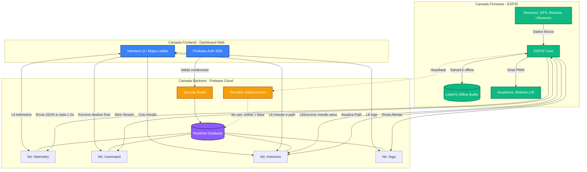
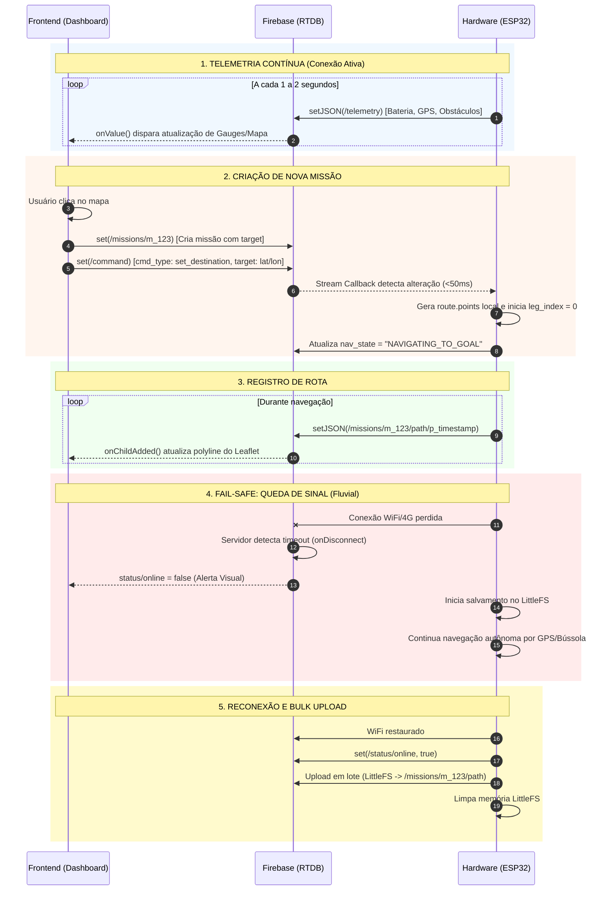
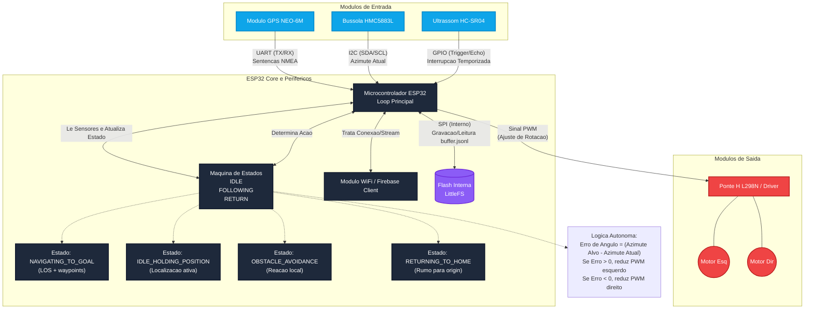

# USV-AM - Autonomous Fluvial Drone System

**Status:** Active Development (Phase 1: MVP - Sprint F0:F5 | 28/03/2026 - 18/05/2026)  
**Version:** 1.0 (Foundation Release)  
**Repository:** Complete End-to-End Development

---

## 1. Project Overview

USV-AM (Unmanned Surface Vehicle - Amazon) is a comprehensive open-source platform for autonomous navigation and monitoring of Amazonian river systems. The project combines embedded systems, cloud infrastructure, and web-based operations into an integrated system capable of autonomous navigation, obstacle detection, telemetry collection, and real-time remote monitoring.

### 1.1 Project Goals

- **Operational Autonomy:** Firmware operates completely independent of backend/cloud infrastructure
- **Real-time Monitoring:** Frontend provides live tracking, telemetry, and operator control
- **Reliability & Safety:** Multiple fail-safes, offline buffering, and emergency procedures
- **Scalability:** Architecture supports multi-drone coordination (future phases)
- **Open Source:** Community-driven development with transparent specifications

### 1.2 Phase 1: MVP (Minimum Viable Product) Scope

**Delivery Date:** May 18, 2026  
**Objectives:**
- Functional catamaran-type watercraft with differential propulsion
- GPS-based autonomous waypoint navigation
- Real-time telemetry streaming to cloud
- Web-based dashboard for operator control
- Offline fail-safe with automatic buffering and resync
- Obstacle detection and emergency stop capabilities

## 2. Functional Scope

This section summarizes Phase 1 capabilities. **For detailed requirements, see `docs/PRD.md`**.

### 2.1 Firmware Layer (ESP32-based Embedded System)

**Core Capabilities:**
- ✅ Autonomous navigation via differential propulsion (2 DC motors)
- ✅ GPS-based mission execution with active target and route history
- ✅ Multi-waypoint navigation with automatic leg control (WP_i → WP_{i+1})
- ✅ Digital compass heading control (HMC5883L calibrated)
- ✅ Obstacle detection with real-time avoidance (HC-SR04 ultrasonic)
- ✅ Cloud telemetry streaming with fail-safe offline buffering (LittleFS)
- ✅ Mission autonomy independent of backend connectivity
- ✅ Current compensation using Line-of-Sight (LOS) algorithm with GPS + compass estimation

**Operating States:**
- `IDLE_HOLDING_POSITION` - Ready for commands, maintaining location
- `NAVIGATING_TO_GOAL` - Following waypoint path with LOS control
- `OBSTACLE_AVOIDANCE` - Local reactive navigation
- `RETURNING_TO_HOME` - Emergency or mission-end return sequence
- `OFFLINE_NAVIGATION` - Full autonomy without cloud connection (guaranteed)

### 2.2 Backend/Cloud Layer (Firebase RTDB + Security Rules)

**Core Capabilities:**
- ✅ Real-time telemetry, command, mission, and log persistence
- ✅ Structured data schema for reliable firmware-frontend contract
- ✅ Role-based access control (firmware, operator, admin)
- ✅ Presence detection and online/offline status management
- ✅ Atomic status updates with consistency guarantees
- ✅ Event logging with searchable/filterable archives
- ✅ Data indices for efficient mission and log queries

### 2.3 Frontend Layer (React + Leaflet Web Dashboard)

**Core Capabilities:**
- ✅ Real-time operator dashboard (map 70%, telemetry 25%, logs 15%)
- ✅ Operator authentication via Firebase Auth
- ✅ Live map visualization with drone marker and heading rotation
- ✅ Telemetry display: battery, motors, heading, obstacle distance, route progress
- ✅ Mission control: destination setting, emergency stop with confirmation
- ✅ Event log viewer with All / Warnings / Errors filtering
- ✅ Responsive design for desktop, tablet, and mobile operation
- ✅ Visual connection status indicator

## 3. System Architecture


### 3.2.2 Sequencia de comunicacao (Frontend <-> Firebase <-> Firmware)


### 3.2.3 Logica de hardware (firmware)


## 4. Componentes e Materiais

### 4.1 Eletronica principal
| Quant. | Componente | Funcao |
|---|---|---|
| 1 | Microcontrolador (ESP32) | Processamento e comunicacao Wi-Fi |
| 1 | Modulo GPS NEO-6M | Coordenadas geograficas e velocidade/curso sobre o solo |
| 1 | Bussola digital | Determinacao de rumo da embarcacao |
| 1 | Sensor de obstaculo ultrassonico | Deteccao de obstaculos flutuantes e margens |
| 1 | Driver de motores (ponte H) | Controle de potencia enviada aos motores |
| 2 | Motores | Propulsao diferencial da embarcacao |
| 1 | Bateria | Alimentacao do prototipo |
| 1 | Carregador de bateria | Recarga segura |
| 1 | Regulador de tensao | Estabilizacao de tensao |

### 4.2 Estrutura fisica
| Quant. | Componente | Funcao |
|---|---|---|
| 2 | Garrafas PET | Flutuadores do catamara |
| 1 | Pote plastico | Caixa estanque para eletronica |

### 4.3 Conexao e montagem
| Quant. | Material | Funcao |
|---|---|---|
| ~10 | Jumpers | Interligacao entre componentes |
| 2 | Conectores eletricos | Engate/desengate de circuitos |
| 1/1 | Solda e ferro de solda | Fixacao eletrica permanente |
| 1 | Fita isolante | Protecao e isolamento |
| 1 | Cola quente | Fixacao mecanica |
| 4 | Parafusos pequenos | Fixacao estrutural |
| 2 | Suportes/abracadeiras plasticas | Organizacao de cabos |

### 4.4 Software e ferramentas
- Arduino IDE 2.x ou PlatformIO
- React + Vite (frontend)
- Firebase RTDB + Firebase Auth
- Bibliotecas de GPS e sensores (TinyGPS++, drivers I2C/GPIO)

## 5. Manual de Execucao por Camada (Sequencial)

## 5.0 Etapa comum (obrigatoria para iniciar)
1. Criar e versionar estrutura do repositorio (`firmware`, `backend`, `frontend`, `docs`).
2. Provisionar projeto Firebase (RTDB + Auth) e configurar variaveis seguras.
3. Montar o hardware minimo e validar alimentacao estavel.
4. Definir `drone_id` padrao do MVP (ex.: `drone_01`).

Criterio de saida: ambiente pronto, acesso ao RTDB validado e hardware energizado sem instabilidade.

### 5.1 Sequencia Firmware (ESP32)
1. Configurar toolchain e bibliotecas do ESP32.
2. Subir firmware basico com conexao Wi-Fi e heartbeat de presenca.
3. Integrar leitura de GPS (NEO-6M), bussola e ultrassom sem bloqueios (`millis()`).
4. Implementar maquina de estados (`IDLE`, `FOLLOWING_ROUTE`, `RETURNING_TO_ORIGIN`, `OFFLINE_NAVIGATION`).
5. Implementar stream de comando em `/drones/{drone_id}/command`.
6. Gerar rota local por waypoints a partir de `target` (sem dependencia de backend).
7. Implementar envio de telemetria para `/drones/{drone_id}/telemetry` (1-2 s).
8. Implementar escrita de status em `/drones/{drone_id}/status`.
9. Implementar registro de `path` em `/missions/{mission_id}/path/p_<ts>`.
10. Implementar logs (`obstacle_detected`, `connection_restored`, `mission_completed`).
11. Implementar fail-safe: buffer em `LittleFS` + flush na reconexao.
12. Integrar compensacao de correnteza por LOS (Secao 8).

Criterio de saida: firmware executa missao completa com retorno de dados e tolerancia a desconexao.

#### 5.1.1 Detalhamento dos passos da sequência de firmware
1. Toolchain: fixar versoes de board ESP32 e bibliotecas para build reprodutivel.
2. Wi-Fi/presenca: configurar reconexao automatica e `onDisconnect()` para `online=false`.
3. Sensores: separar leitura por frequencia para evitar bloqueio do loop principal.
4. Estados: criar transicoes explicitas com timeout e fallback seguro.
5. Comando: consumir apenas comandos novos com `command_id` para evitar reprocessamento.
6. Rota local: gerar waypoints e pernas localmente com base em `origin`, `target` e regras de seguranca.
7. Telemetria: publicar payload completo a cada 1-2 s e validar campos obrigatorios.
8. Status: atualizar `nav_state`, `active_leg` e `route_progress` diretamente em `/status`.
9. Path: registrar pontos com timestamp monotônico e associacao ao `mission_id` ativo.
10. Logs: padronizar tipos e severidade para auditoria no dashboard.
11. Fail-safe: persistir rota/estado local, usar hash de pontos para deduplicacao ao flush.
12. LOS: calibrar `Delta` (5-10m rio), `Kp` (0.1-0.3), `R_switch` (3-6m), `leg_timeout` (30s).

**Algoritmo de geracao de waypoints (contexto Amazonas):**
- Entrada: `origin` (lat/lon), `target` (lat/lon), velocidade media estimada do rio (~0.5-1.5 m/s).
- Estrategia: interpolacao linear com N-1 waypoints intermediarios (ex. N=3 para rota ~1-2 km).
- Adaptacao: reduzir `R_switch` se correnteza local forte (estimada por `|COG - heading| > 10°`).
- Timeout de perna: 30s maximo em `R_switch` antes de forcar avanço (proteção contra corrente paralisante).
- Codigo pseudo: `for i in range(N): WP[i] = origin + (target - origin) * (i / (N-1))`.

#### 5.1.2 Sequencia de navegacao por waypoints e controle de perna
1. Definir estrutura local da rota como fila ordenada de waypoints, gerada no firmware.
2. Inicializar `leg_index = 0` e ativar perna `WP_0 -> WP_1`.
3. Em cada ciclo de controle, calcular `gamma_p`, erro transversal `e_ct` e `chi_d` (LOS).
4. Converter `chi_d` em `psi_ref` com compensação estimada de correnteza (`beta_hat`).
5. Aplicar controle diferencial PWM até entrar no raio de troca (`R_switch`) do `WP_{i+1}`.
6. Ao atingir `R_switch`, **disparar timer de 30s**; se permanecer em `R_switch` apos timeout, forcar avanço de `leg_index`.
7. Encerrar a missão quando o último waypoint for atingido e publicar `mission_completed`.
8. Registrar pontos em `path` com chave temporal para preservar histórico completo de pernas.

Criterio de aceite: completar rota com pelo menos 3 waypoints, transição automática entre pernas e fechamento de missão sem intervenção manual.

### 5.2 Sequencia Backend/Cloud (Firebase RTDB)
1. Publicar schema canonico do RTDB.
2. Aplicar Security Rules por ator (firmware vs frontend).
3. Criar indices de consulta para `missions` e `logs`.
4. Validar `onDisconnect()` para status de presenca.
5. Configurar politica de retencao para logs.
6. Persistir rota observada e metadados da missao para auditoria e monitoramento.

Criterio de saida: backend seguro, performatico e com contrato de dados estavel.

#### 5.2.1 Detalhamento dos passos da sequência de backend/cloud
1. Schema: congelar paths e tipos para evitar quebra de integracao entre camadas.
2. Rules: limitar escrita de status/telemetria ao firmware e comando ao frontend.
3. Indices: priorizar filtros por `drone_id`, `mission_id`, `status` e `timestamp`.
4. Presenca: testar desconexao real para validar escrita automatica de `online=false`.
5. Retencao: manter limite de logs e rotina de limpeza para nao degradar leitura.
6. Missao: armazenar rota/pernas calculadas no firmware para rastreabilidade e analise pos-missao.

### 5.3 Sequencia Frontend (React + React Leaflet)
1. Criar app React (Vite) e configurar Firebase SDK.
2. Implementar autenticacao do operador.
3. Implementar mapa React Leaflet com marcador do drone.
4. Implementar painel de telemetria (bateria, obstaculo, modo operacional, atuadores).
5. Implementar criacao de missao e envio de `set_destination`.
6. Implementar botao `emergency_stop`.
7. Implementar renderizacao de `path` em tempo real.
8. Implementar painel de logs e alertas visuais.
9. Implementar visualizacao de progresso de rota (`active_leg`, `route_progress`).
10. Testar fluxo de ponta a ponta com hardware real.

Criterio de saida: operador consegue comandar missao e monitorar estado em tempo real.

#### 5.3.1 Detalhamento dos passos da sequência de frontend
1. Bootstrap: padronizar estrutura React e separar modulos por dominio (mapa, telemetria, missao, logs).
2. Auth: proteger rotas do dashboard e bloquear escrita sem usuario autenticado.
3. Mapa: centralizar no rio alvo e manter marcador orientado por heading.
4. Telemetria: renderizar atualizacao reativa sem travar a UI em bursts de dados.
5. Destino: enviar apenas coordenada final da missao, sem editor manual de waypoints.
6. Safety: confirmar acao critica de `emergency_stop` com feedback imediato de UI.
7. Path: desenhar trilha incremental por `onChildAdded` para evitar recarga completa.
8. Logs: categorizar eventos e destacar alarmes de obstaculo/conectividade.
9. Progresso: exibir perna ativa e percentual da rota para leitura operacional.
10. E2E: validar ciclo completo em bancada e em agua com evidencias registradas.

## 6. Contrato de Dados (RTDB)

### 6.1 Arvore canonica
```text
/
|- drones/
|  |- {drone_id}/
|     |- telemetry/
|     |- command/
|     |- status/
|- missions/
|  |- {mission_id}/
|- logs/
   |- {log_id}/
```

### 6.2 Telemetria
Path: `/drones/{drone_id}/telemetry`

```json
{
  "position": { "lat": -3.1019, "lon": -60.0250, "heading": 145.2 },
  "sensors": { "battery_mv": 7400, "obs_dist": 120 },
  "actuators": { "thrust_l": 80, "thrust_r": 45 },
  "mission_id": "m_1710624000",
  "timestamp": 1710624000
}
```

### 6.3 Comando
Path: `/drones/{drone_id}/command`

```json
{
  "command_id": "cmd_1710624000",
  "target": { "lat": -3.1050, "lon": -60.0300 },
  "mission_id": "m_1710624000",
  "cmd_type": "set_destination",
  "issued_at": 1710624000
}
```

Regra do MVP: frontend envia apenas o destino final. Waypoints sao calculados automaticamente e publicados na missao.

Comando de seguranca:

```json
{
  "command_id": "cmd_1710624900",
  "mission_id": "m_1710624000",
  "cmd_type": "emergency_stop",
  "issued_at": 1710624900
}
```

### 6.4 Missao
Path: `/missions/{mission_id}`

```json
{
  "drone_id": "drone_01",
  "start_time": 1710624000,
  "status": "active",
  "origin": { "lat": -3.1019, "lon": -60.0250 },
  "target": { "lat": -3.1050, "lon": -60.0300 },
  "route": {
    "source": "firmware_autonomous",
    "version": 1,
    "active_leg": 0,
    "points": [
      { "idx": 0, "lat": -3.1019, "lon": -60.0250 },
      { "idx": 1, "lat": -3.1035, "lon": -60.0268 },
      { "idx": 2, "lat": -3.1050, "lon": -60.0300 }
    ]
  },
  "path": {
    "p_1710624001": { "lat": -3.1019, "lon": -60.0250, "ts": 1710624001 }
  }
}
```

### 6.5 Logs
Path: `/logs/{log_id}`

```json
{
  "drone_id": "drone_01",
  "mission_id": "m_1710624000",
  "type": "obstacle_detected",
  "position": { "lat": -3.1020, "lon": -60.0255 },
  "value": 0.8,
  "timestamp": 1710624050
}
```

### 6.6 Status operacional (canonico)
Path: `/drones/{drone_id}/status`

```json
{
  "online": true,
  "last_seen": 1710624050,
  "active_mission_id": "m_1710624000",
  "nav_state": "NAVIGATING_TO_GOAL",
  "active_leg": 1,
  "route_progress": 0.52,
  "last_position": { "lat": -3.1020, "lon": -60.0255 }
}
```

Valores de `nav_state` no MVP:
- `NAVIGATING_TO_GOAL` (em navegacao)
- `IDLE_HOLDING_POSITION` (ocioso mantendo localizacao)
- `OBSTACLE_AVOIDANCE` (desviando de obstaculo)
- `RETURNING_TO_HOME` (retornando para origem)

## 7. Comunicacao Firmware <-> RTDB (RTDB-only)

### 7.0 Garantia de autonomia offline
O firmware **NUNCA** depende do backend para continuar navegacao. Apos receber `set_destination` e gerar `route.points` localmente, o firmware pode permanecer offline indefinidamente e completar a rota. Backend e frontend existem para **monitoramento**, nao para pilotagem.

### 7.1 Recebimento de comandos no firmware
- Abrir stream em `/drones/{drone_id}/command`.
- Processar apenas comandos com `command_id` novo.
- Comandos suportados no MVP: `set_destination` e `emergency_stop`.

### 7.2 Carga de rota automatica
- Apos `set_destination`, gerar rota local por waypoints no firmware.
- **Publicar `route.points` em `/missions/{mission_id}/route` em < 500ms** para que frontend/backend saibam a rota autonoma.
- Persistir `route.points` em `/missions/{mission_id}/route` para monitoramento e auditoria.
- Salvar copia local da rota para manter autonomia em perda de conexao.
- Inicializar execucao em `active_leg = 0`.

### 7.3 Publicacao de dados pelo firmware
- Telemetria: `setJSON` em `/drones/{drone_id}/telemetry` a cada 1-2 s.
- Status: `set` em `/drones/{drone_id}/status` em cada mudanca de estado/perna e ao fim da rota.
- Status: incluir `online`, `nav_state`, `active_leg`, `route_progress` e `last_position` em uma unica escrita para atomicidade.
- Path: `setJSON` em `/missions/{mission_id}/path/p_<ts>` durante navegacao.
- Logs: `pushJSON` em `/logs` para eventos operacionais.

**Deduplicacao de path offline:**
- Ao reconectar, firmware calcula hash SHA256 dos ultimos 5 pontos ja gravados em RTDB.
- Compara com buffer LittleFS: se primeiros 5 pontos coincidem, inicia flush a partir do 6º ponto.
- Se hash diverge, recomeca flush do primeiro ponto com novo timestamp.
- Exemplo: `hash(path[0..4]) == hash(LittleFS[0..4])` -> continue a partir de `path[5]`.

### 7.4 Presenca e fail-safe
- Configurar `onDisconnect()` para escrever `online=false` em `/drones/{drone_id}/status`.
- Em reconexao, restaurar `online=true`, atualizar `last_seen` e executar flush do `LittleFS`.
- **A escrita de `online` é atomica com o resto do status para evitar leitura parcial.**

### 7.5 Autoridade de status
- O firmware e a fonte de verdade para `nav_state`, `active_leg`, `route_progress` e status da missao.
- Frontend nao escreve status operacional do drone.
- Ao concluir a rota, firmware muda `nav_state` para `IDLE_HOLDING_POSITION` e continua enviando localizacao.

## 15. Compensacao de Correnteza (LOS + NEO-6M)

### 8.1 Objetivo
Reduzir erro lateral de trajeto em rios com correnteza, mantendo a embarcacao proxima da linha entre origem e destino.

### 8.2 Entradas usadas no controle
- GPS NEO-6M: posicao (`lat`, `lon`), `course over ground` (COG), velocidade sobre o solo.
- Bussola digital: heading da embarcacao (`psi`).
- Waypoint ativo: origem da perna (`WP_i`) e destino (`WP_{i+1}`).

### 8.3 Formula base LOS
1. Converter coordenadas para plano local (ENU ou aproximacao local).
2. Calcular angulo da perna:
   - `gamma_p = atan2(y_wp - y_i, x_wp - x_i)`
3. Calcular erro transversal `e_ct` em relacao a perna.
4. Definir lookahead `Delta` (ex.: 3 m a 8 m no prototipo).
5. Curso desejado LOS:
   - `chi_d = gamma_p - atan(e_ct / Delta)`

### 8.4 Compensacao de correnteza sem sensor dedicado
Como o MVP nao possui sensor de correnteza dedicado, usar estimativa por diferenca entre curso e heading:
- `beta_hat = wrapToPi(COG_gps - psi_bussola)`
- `psi_ref = chi_d - beta_hat`

`psi_ref` vira referencia para o controle de propulsao diferencial.

### 8.5 Mapeamento para propulsao diferencial
- Erro angular: `e_psi = wrapToPi(psi_ref - psi_bussola)`
- Controle simples:
  - `thrust_l = base - Kp * e_psi`
  - `thrust_r = base + Kp * e_psi`
- Aplicar saturacao PWM e rampa para evitar oscilacao.

### 8.6 Criterio minimo de validacao
- Em trecho com correnteza leve/moderada, manter erro transversal medio abaixo do limite definido pelo grupo (ex.: <= 2.5 m em trecho de teste).
- Registrar comparativo `sem compensacao` vs `com LOS + beta_hat`.

## 14. Cronograma de Execucao Detalhado (28/03/2026 ate 18/05/2026)

**INICIO REAL: 28/03/2026 (HOJE)**  
**HARDWARE ESPERADO: ~28/04/2026**  
**DEADLINE MVP: 18/05/2026**  
**DESENVOLVIMENTO: PARALELO (Firmware + Backend + Frontend)**

### Visao Geral

| Fase | Datas | Duracao | Foco |
|---|---|---|---|
| **F0** | 28/03-30/03 | 3 dias | Fundacao (repo + RTDB + inicio frontend) |
| **F1** | 31/03-13/04 | 2 semanas | Desenvolvimento paralelo com mocks |
| **F2** | 14/04-27/04 | 2 semanas | Preparacao pre-hardware + refinamentos |
| **F3** | 28/04-07/05 | 10 dias | Integracao com hardware real |
| **F4** | 08/05-14/05 | 7 dias | Refino final (LOS, dedup, estabilidade) |
| **F5** | 15/05-18/05 | 4 dias | Validacao final em campo + entrega |

---

## 14.0 Contabilização de Atividades por Membro

### Resumo de Responsabilidades

| Membro | F0 | F1 | F2 | F3 | F4 | F5 | **Total** |
|---|----|---|---|---|---|---|---|
| **Orlando** | 3  | 6 | 4 | 3 | 2 | 4 | **21** |
| **Ariadne** | 4  | 6 | 3 | 4 | 3 | 2 | **21** |
| **Leonora** | 0  | 0 | 1 | 3 | 1 | 5 | **11** |
| **Lucinao** | 0  | 0 | 0 | 2 | 2 | 5 | **10** |

### Distribuição por Área

| Área | Orlando | Ariadne | Leonora | Lucinao |
|---|---|---|---|---|
| **Firmware** | 13 | — | — | 5 |
| **Backend (Geral)** | 5 | 7 | — | — |
| **Frontend** | — | 14 | 5 | — |
| **Hardware/Testes** | — | — | 6 | 5 |
| **Integração/Documentação** | 3 | — | — | — |

### Legenda de Responsabilidades

- **Orlando (21 atividades):** Firmware e Backend para Firmware (desenvolvimento autonomo)
- **Ariadne (21 atividades):** Frontend, Dashboard e Backend para Frontend (integração e interface)
- **Leonora (9 atividades):** Testes do projeto e Montagem do Hardware (validação e assembly)
- **Lucinao (8 atividades):** Montagem do Hardware/Protótipo e Testes em Campo (prototipagem e testes práticos)

---

## 14.1 FASE F0: Fundacao (28/03-30/03) - 3 DIAS

**Objetivos:** consolidar base do projeto e alinhar arquitetura.

- [ ] GitHub: repositorio, branches (`main`, `dev`, `feature/*`) e estrutura de pastas. (**Orlando, Ariadne**)
- [ ] RTDB/Auth: provisionamento, seed inicial e variaveis seguras. (**Ariadne, Orlando**)
- [ ] Firmware: Configuração e Teste de Ambiente de Desenvolvimento Firmware. (**Orlando**)
- [ ] Frontend: bootstrap React + Vite e estrutura inicial. (**Ariadne**)
- [ ] Design: wireframe v1 (mapa, telemetria, logs, acoes). (**Ariadne**)

**Criterio F0:** ambiente pronto, repo organizado, RTDB ativo e frontend iniciando.

---

## 14.2 FASE F1: Desenvolvimento Paralelo com Mocks (31/03-13/04)

### Firmware
- [ ] Conexao Wi-Fi + stream de comando no RTDB. (**Orlando**)
- [ ] Maquina de estados + telemetria mock. (**Orlando**)
- [ ] Geracao local de waypoints + `nav_state`. (**Orlando**)
- [ ] Buffer `LittleFS` e registro de `path`. (**Orlando**)

### Backend/Cloud
- [ ] Security Rules por papel (firmware/frontend/admin). (**Ariadne, Orlando**)
- [ ] Testes de permissao e `onDisconnect()`. (**Ariadne, Orlando**)
- [ ] Politica de retencao de logs. (**Ariadne**)

### Frontend
- [ ] Mapa React Leaflet + listeners de telemetria. (**Ariadne**)
- [ ] Painel de status, telemetria e logs com dados mock. (**Ariadne**)
- [ ] Fluxo `set_destination` e `emergency_stop`. (**Ariadne**)

**Criterio F1:** funcionalidades principais operando com dados mockados de ponta a ponta.

---

## 14.3 FASE F2: Preparacao Pre-Hardware (14/04-27/04)

### Firmware
- [ ] LOS basico, timeout de perna e deduplicacao de path. (**Orlando**)
- [ ] Revisao de pinagem e preparacao de firmware para hardware real. (**Orlando**)
- [ ] Testes de autonomia offline e reconexao. (**Orlando**)

### Frontend
- [ ] Polimento de UX/UI e estados de erro/loading. (**Ariadne**)
- [ ] Testes E2E com dados simulados realistas. (**Ariadne, Leonora**)

**Criterio F2:** stack estabilizada e pronta para conectar hardware em 28/04.

---

## 14.4 FASE F3: Integracao com Hardware Real (28/04-07/05)

### Firmware
- [ ] Montagem e bring-up: ESP32 + GPS + bussola + ultrassom. (**Orlando, Lucinao**)
- [ ] Calibracao inicial dos sensores. (**Orlando, Lucinao**)
- [ ] Publicacao de telemetria real no RTDB. (**Orlando**)

### Backend/Cloud
- [ ] Validar fluxo real de dados, presenca e logs. (**Ariadne, Orlando**)
- [ ] Ajustar indices/regras conforme comportamento observado. (**Ariadne**)

### Frontend
- [ ] Validar mapa com posicao real do drone. (**Ariadne, Leonora**)
- [ ] Validar missao fim-a-fim com `set_destination`. (**Ariadne, Leonora**)
- [ ] Monitorar `nav_state`, `active_leg` e `route_progress` em tempo real. (**Ariadne, Leonora**)

**Criterio F3:** operacao real em bancada/agua calma com telemetria e comando funcionando.

---

### 11.7 Phase F4: Final Refinement (08/05-14/05)

**Objectives:** Performance tuning, field readiness, operational polish

**Firmware Tasks (Orlando + Lucinao):**
- [ ] Adjust current compensation (`beta_hat`) for Amazonas context
- [ ] Calibrate LOS parameters (Delta, Kp, R_switch) and stability
- [ ] Consolidate deduplication and fail-safe mechanisms
- [ ] Full system stress testing

**Frontend Tasks (Ariadne):**
- [ ] Visual polish and operational refinement
- [ ] Final logs panel and alerts for field use
- [ ] Bright-light readability testing
- [ ] Last-mile UX improvements

**Exit Criteria:** System ready for final validation cycle in river

---

### 11.8 Phase F5: Final Validation & Delivery (15/05-18/05)

**Objectives:** Comprehensive field testing and MVP acceptance

**Validation Tests (All):**
- [ ] Offline autonomy: drone continues without backend
- [ ] Emergency stop execution and return to origin
- [ ] Obstacle detection and avoidance continuity
- [ ] Multi-leg navigation (3+ waypoints minimum)
- [ ] WiFi reconnection and LittleFS buffer sync
- [ ] Live dashboard monitoring end-to-end

**Documentation & Evidence (Leonora, Ariadne):**
- [ ] Video recordings of field missions
- [ ] RTDB exported logs for audit trail
- [ ] Dashboard screenshots and metrics
- [ ] Comprehensive test report with acceptance criteria

**Final Documentation (Orlando, Ariadne):**
- [ ] Code cleanup and repository organization
- [ ] README and PRD finalization
- [ ] Architecture diagrams and technical notes
- [ ] Deployment and setup guides

**Exit Criteria:** MVP validated, documented, and ready for demonstration by **18/05/2026**

---

## 12. Frontend Design & React Architecture

### 12.1 Design Philosophy

The dashboard follows the **autonomous vehicle in river** paradigm: the operator **observes and commands**, does not manually pilot. Interface is minimalist, focused on state indicators, route visualization, and operational logs.

**Key Principles:**
- Map always visible (70% of viewport)
- Telemetry in right sidebar (25%)
- Logs in tabbed bottom panel (15%)
- Large, confirmation-based action buttons
- Responsive for tablet operation in field

---

### 12.2 Dashboard Layout & Wireframe

```
┌─────────────────────────────────────────────────────────────┐
│  Logo | Drone: drone_01 | Status: ONLINE | User: [operador] │
├──────────────────────┬────────────────────────────────────────┤
│                      │  TELEMETRIA (Painel Lateral Direito)   │
│                      │  ┌──────────────────────────────────┐  │
│    MAPA (70%)        │  │ Bateria: ████████░ 75%          │  │
│   React Leaflet      │  │ Modo: NAVIGATING_TO_GOAL         │  │
│   Centrado Rio       │  │ Perna: 2/3  [████░░░░░ 50%]    │  │
│   Marcador Drone     │  │ Obstáculo: 1.2m (OK)            │  │
│   Rota em azul       │  │ Motores L: 75  R: 65 (PWM)       │  │
│   Waypoints          │  │ Último update: 2s atrás          │  │
│                      │  │                                  │  │
│                      │  │ [set_destination]  [e-stop]      │  │
│                      │  └──────────────────────────────────┘  │
├──────────────────────┴────────────────────────────────────────┤
│  LOGS / EVENTOS                                               │
│  ┌─────────────────────────────────────────────────────────┐ │
│  │ [All] [Warnings] [Errors]                           ^ v │ │
│  │ 14:35 - NAVIGATING_TO_GOAL | leg_index = 1          │ │
│  │ 14:32 - obstacle_detected | dist=0.8m               │ │
│  │ 14:28 - connection_restored | RTDB sync             │ │
│  │ 14:20 - mission_started | 3 waypoints queued        │ │
│  └─────────────────────────────────────────────────────────┘ │
└──────────────────────────────────────────────────────────────┘
```

---

### 12.3 React Component Structure

```
/frontend/src/
├── components/
│   ├── Navbar.jsx            # Barra superior (logo, status, user)
│   ├── Map.jsx               # Mapa Leaflet + interações
│   ├── TelemetryPanel.jsx    # Painel lateral direito
│   │   ├── BatteryGauge.jsx
│   │   ├── StateIndicator.jsx
│   │   └── MotorStatus.jsx
│   ├── Logs.jsx              # Painel logs inferior
│   │   ├── LogEntry.jsx
│   │   └── LogFilter.jsx
│   └── Modals.jsx
│       ├── SetDestinationModal.jsx
│       └── ConfirmStopModal.jsx
├── pages/
│   └── Dashboard.jsx         # Composição principal
├── hooks/
│   ├── useFirebaseAuth.js    # Auth
│   ├── useFirebaseTelemetry.js
│   └── useMissionManager.js
├── services/
│   ├── firebaseService.js    # RTDB queries
│   └── geoUtils.js           # Cálculos de distância/azimute
├── styles/
│   ├── global.css            # Reset + variáveis
│   ├── dashboard.css         # Layout principal
│   └── components.css        # Componentes
└── App.jsx
```

---

### 12.4 Visual Details by Section

#### **A) NAVBAR (Barra Superior)**

**Conteúdo:**
- Logo + Título: "USV-AM"
- Status do drone em tempo real (ONLINE/OFFLINE com cor)
- ID do drone: `drone_01`
- Status operacional: `NAVIGATING_TO_GOAL` (cor dinâmica)
- Nome do operador (logout)

**Cores:**
- ONLINE: verde (#10b981)
- OFFLINE: vermelho (#ef4444)
- NAVIGATING: azul (#3b82f6)
- IDLE: cinza (#9ca3af)
- OBSTACLE_AVOIDANCE: laranja (#f59e0b)
- RETURNING_TO_HOME: amarelo (#eab308)

**Responsive:** Na versão mobile, ícones em vez de textos longos.

---

#### **B) MAPA (React Leaflet)**

**Características:**
1. **Centro inicial:** Rio Negro, Manaus (-3.1019, -60.0250)
2. **Zoom:** 14 (nível de detalhe em rio)
3. **Tiles:** OpenStreetMap (padrão)
4. **Marcador drone:**
   - Ícone customizado (⛵ ou 🤖)
   - Rotação = `heading` em tempo real
   - Label: `drone_01`
5. **Rota visível:**
   - Polyline azul conectando pontos de `path`
   - Recarregar incrementalmente por `onChildAdded`
6. **Waypoints:**
   - Círculos numerados (1, 2, 3...)
   - Cor verde (não atingido) → amarelo (perna ativa) → cinza (completo)
7. **Clique no mapa:** Abre modal `SetDestinationModal`
8. **Gesturas:** Pan, zoom, dblclick para home

**Performance:** Virtual scrolling de marcadores se houver muitos logs/waypoints.

---

#### **C) PAINEL DE TELEMETRIA (Lateral Direito, ~25% width)**

**Widgets:**

1. **Medidor de Bateria (Gauge)**
   ```
   ┌─────────────────┐
   │    Bateria      │
   │  ████████░░ 75% │
   │ 7.4V / 4000mAh  │
   └─────────────────┘
   Cores: >70% verde, 30-70% amarelo, <30% vermelho
   ```

2. **Indicador de Estado (Badge)**
   ```
   ┌──────────────────────────────────┐
   │ NAVIGATING_TO_GOAL               │
   └──────────────────────────────────┘
   Fundo dinâmico por nav_state
   ```

3. **Progresso da Rota (Barra Linear)**
   ```
   Perna: 2 / 3
   [████░░░░░░] 50%
   ```

4. **Sensor Ultrassônico (Gauge Circular)**
   ```
      1.2m
      /\
     /  \
    |    |  OK
     \  /
      \/
   Vermelho se < 50cm
   ```

5. **Status de Motores (Dois sliders readonlys)**
   ```
   Motor L: ████████░░ 75 PWM
   Motor R: ██████░░░░ 60 PWM
   ```

6. **Timestamp de última atualização**
   ```
   Last update: 2s ago
   Cor muda para vermelho se > 10s
   ```

7. **Botões de Ação**
   ```
   ┌──────────────────┐  ┌────────────────┐
   │ Set Destination  │  │ Emergency Stop │
   └──────────────────┘  └────────────────┘
   Primária (azul)        Perigo (vermelho)
   ```

---

#### **D) PAINEL DE LOGS (Inferior, ~15% height)**

**Layout:**
- 3 abas: [All] [Warnings] [Errors]
- Tabela com scroll vertical
- Colunas: **Hora | Tipo | Mensagem | +Info**

**Exemplo:**
```
┌──────────────────────────────────────────────────────────┐
│ [All] [⚠️ 2] [❌ 0]                                    ^ v│
├──────────────────────────────────────────────────────────┤
│ 14:35 | NAV       | NAVIGATING_TO_GOAL / leg 1/3       │
│ 14:32 | ⚠️ OBS    | obstacle_detected @ 0.8m [-3.10]   │
│ 14:28 | ✅ CONN   | connection_restored / sync complete│
│ 14:20 | MISSION   | mission_started / 3 waypoints      │
└──────────────────────────────────────────────────────────┘
```

**Tipos de eventos (cores):**
- NAV: azul
- OBS: laranja
- CONN: verde
- EMERGENCY: vermelho
- MISSION: roxo

---

#### **E) MODAIS (Pop-ups)**

**1. Set Destination Modal**
```
┌─────────────────────────────────────┐
│   Definir Novo Destino              │
├─────────────────────────────────────┤
│ Latitude:  [ -3.1050________]       │
│ Longitude: [ -60.0300_______]       │
│                                     │
│ ou clique no mapa                   │
│                                     │
│ Previsão de tempo: ~3 min           │
│ Distância: 500 m                    │
│                                     │
│   [Cancelar]  [Confirmar Destino]   │
└─────────────────────────────────────┘
```

**2. Emergency Stop Confirmation Modal**
```
┌─────────────────────────────────────┐
│   ⚠️ PARAR MISSÃO                   │
├─────────────────────────────────────┤
│                                     │
│  Tem certeza?                       │
│  O drone retornará para a origem.   │
│                                     │
│   [Não, continuar]  [Sim, parar]    │
└─────────────────────────────────────┘
```

---

### 12.5 User Interaction Flows (User Stories)

#### **Cenário 1: Iniciar Missão**
1. Operador vê mapa carregado, drone em IDLE
2. Clica em ponto no mapa → modal de confirmação
3. Insere lat/lon ou confirma do clique
4. Clica "Confirmar Destino"
5. Painel telemetria muda para NAVIGATING_TO_GOAL
6. Rota azul aparece no mapa em tempo real
7. Marcador drone se move seguindo a rota

#### **Cenário 2: Monitorar Navegação**
1. Operador observa painel telemetria:
   - Progresso de perna (2/3)
   - Status de motores (L: 75 PWM, R: 65 PWM)
   - Bateria em queda (agora 65%)
2. Se obstáculo: indicador muda para laranja, log aparece
3. Ao atingir waypoint: perna avança automaticamente
4. Ao fim: nav_state muda para IDLE_HOLDING_POSITION

#### **Cenário 3: Emergency Stop**
1. Operador vê risco
2. Clica "Emergency Stop"
3. Modal de confirmação aparece
4. Confirma
5. nav_state muda para RETURNING_TO_HOME
6. Drone retorna para `origin`
7. Log aparece: "emergency_stop @ 14:35"

---

### 12.6 Implementation Details (Code Structure)

#### **Hooks Principais**

**useFirebaseTelemetry.js:**
```javascript
export function useFirebaseTelemetry(droneId) {
  const [telemetry, setTelemetry] = useState(null);
  const [status, setStatus] = useState(null);

  useEffect(() => {
    // Listener em /drones/{droneId}/telemetry
    onValue(ref(db, `drones/${droneId}/telemetry`), (snapshot) => {
      setTelemetry(snapshot.val());
    });

    // Listener em /drones/{droneId}/status
    onValue(ref(db, `drones/${droneId}/status`), (snapshot) => {
      setStatus(snapshot.val());
    });
  }, [droneId]);

  return { telemetry, status };
}
```

**useMissionManager.js:**
```javascript
export function useMissionManager(droneId) {
  const [mission, setMission] = useState(null);
  const [path, setPath] = useState([]);

  const setDestination = async (lat, lon) => {
    const mission_id = `m_${Math.floor(Date.now() / 1000)}`;
    
    // Criar missão
    await set(ref(db, `missions/${mission_id}`), {
      drone_id: droneId,
      start_time: Date.now(),
      status: 'active',
      origin: await getDronePosition(), // última posição conhecida
      target: { lat, lon }
    });

    // Enviar comando
    await set(ref(db, `drones/${droneId}/command`), {
      command_id: `cmd_${Date.now()}`,
      target: { lat, lon },
      mission_id,
      cmd_type: 'set_destination',
      issued_at: Date.now()
    });
  };

  const emergencyStop = async (mission_id) => {
    await set(ref(db, `drones/${droneId}/command`), {
      command_id: `cmd_${Date.now()}`,
      mission_id,
      cmd_type: 'emergency_stop',
      issued_at: Date.now()
    });
  };

  return { mission, path, setDestination, emergencyStop };
}
```

---

### 12.7 Color Palette & Typography

**Cores (Tailwind CSS):**
- Primária: `#3b82f6` (azul)
- Perigo: `#ef4444` (vermelho)
- Sucesso: `#10b981` (verde)
- Aviso: `#f59e0b` (laranja)
- Neutra: `#9ca3af` (cinza)

**Tipografia:**
- Sans-serif: `Inter` ou `Roboto`
- Tamanho base: 14px
- Headings: 16px (navbar), 14px (painéis)
- Monospace para valores numéricos: `Fira Code`

---

### 12.8 Frontend Implementation Schedule (Aligned with Phase 1)

| Etapa | Janela | Entrega Frontend |
|---|---|---|
| F0-UI | 28/03-30/03 | Wireframes v1, layout base e fluxo de telas |
| S1 | 31/03-06/04 | Estrutura React + Firebase Auth + mapa base |
| S2 | 07/04-13/04 | Painel de telemetria, logs dinamicos e acoes principais |
| S3 | 14/04-27/04 | Polimento UX/UI, responsividade e testes E2E com mocks |
| S4 | 28/04-07/05 | Integracao com dados reais (hardware) + correcoes |
| S5 | 08/05-14/05 | Acabamento visual final e validacao operacional do dashboard |
| S6 | 15/05-18/05 | Suporte a validacao em campo, ajustes finais e evidencias |

---

### 12.9 MVP Component Checklist

**REQUIRED (Phase 1 MVP):**
- [ ] Navbar with online/offline status indicator
- [ ] Leaflet map centered on river with drone marker
- [ ] Real-time route polyline visualization
- [ ] Telemetry panel (battery gauge, mode, leg progress, obstacle distance)
- [ ] Set destination button (creates mission from click or coordinates)
- [ ] Emergency stop button (with confirmation modal)
- [ ] Logs panel with All / Warnings / Errors filtering
- [ ] Responsive layout (desktop and tablet)

**DESIRABLE (If time permits):**
- [ ] Battery history chart
- [ ] Automatic zoom to route bounds
- [ ] Coordinate autocomplete (known locations)
- [ ] Dark mode toggle

**NOT INCLUDED (Future phases):**
- Manual waypoint editor
- Automatic route planning (firmware generates)
- 3D simulation
- Multi-drone fleet view

---

## 13. Related Documentation

**For complete technical specifications, see:**
- **`docs/PRD.md`** - Product Requirements Document with detailed specs
- **`backend/RTDB_SCHEMA.md`** - Firebase RTDB schema reference
- **`firmware/README.md`** - Firmware setup and build instructions (TBD)
- **`Projeto_PEX/README.md`** - Frontend setup and development guide


